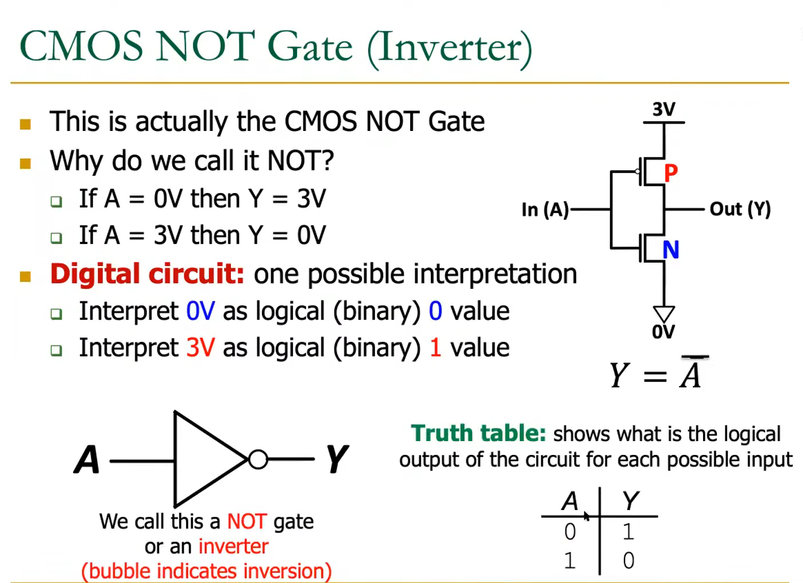
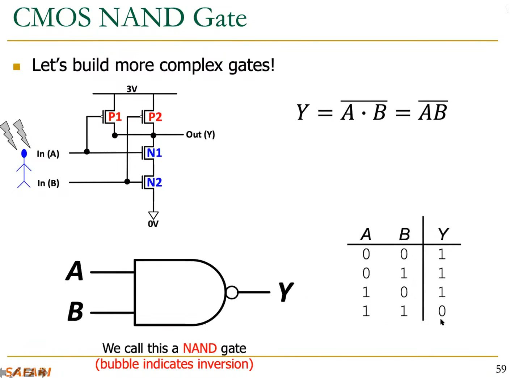
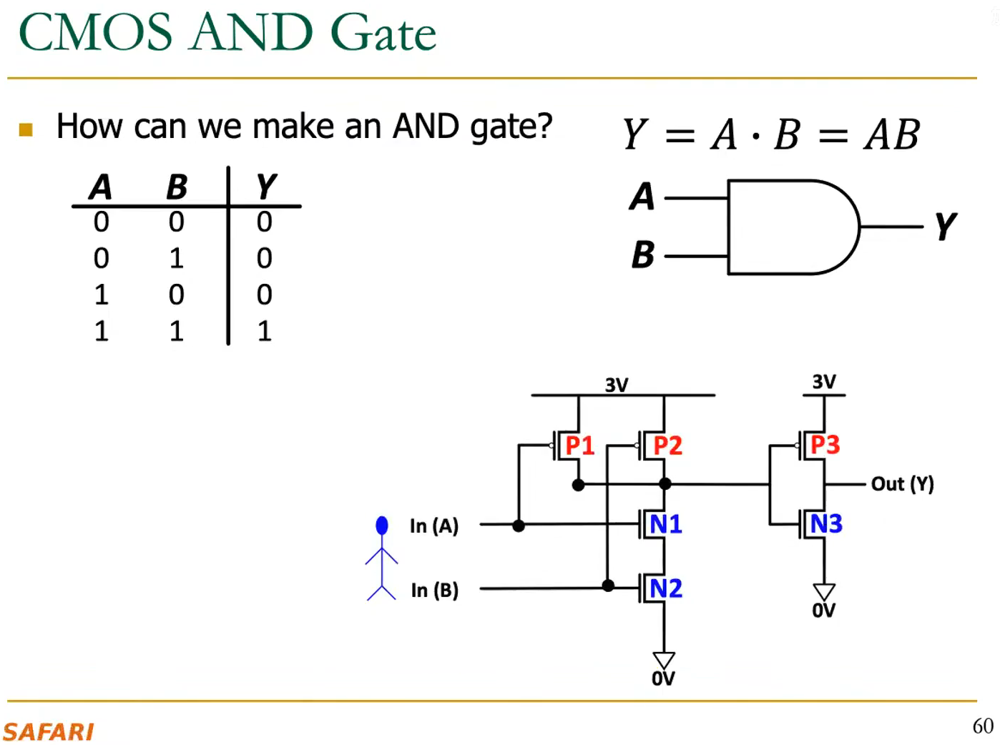

# Combinational Logic Circuits and Design
## 3 key components of a computer:
1. Computation
2. Communication
3. Storage/Memory
---
## transistor
 **MOS** **Transistor**
1. **Combination** :
   1. conductor(Metal)
   2. insulator(Oxide)
   3. Semiconductor
2. **Types**
   1. n-type (regarded as **standard**)  
       1. if the gate of the n-type transistor is supplied with a high voltage(0.3V-3V), the connection from drain to source acts like a piece of wire
       2. if the gate of the n-type transistor is supplied with a zero voltage, the connection from drain to source is broken
   2. p-type (**OPPOSITE** from the n-type)
---
## logic gate

> nMOS + pMOS = CMOS
1. p are good at transmitting the high voltage to the output when input is low voltage; 
>**p** means **up**
>**n** means **down**
2. **reason** : When used as a switch, a transistor's conduction is determined by the **gate-source** voltage

> **NOT** **gate**

>**NAND** **gate**

> **AND** **gate** = **NOT gate** + **NAND** **gate** (mechanism)
>>However **NAND** **gate** = **NOT gate** + **AND** **gate** (signal)
