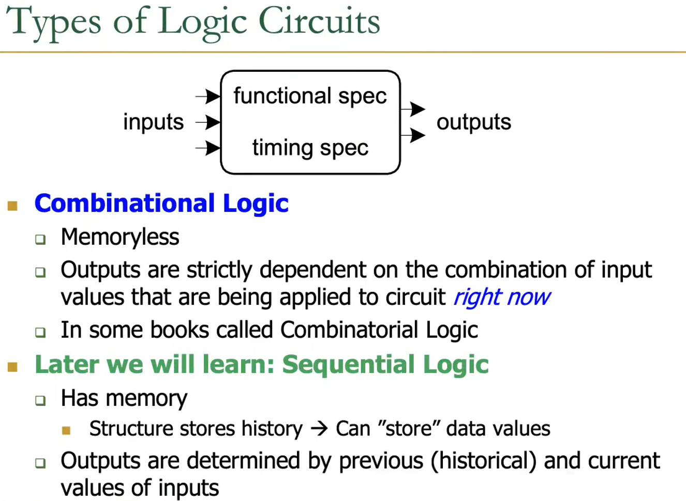
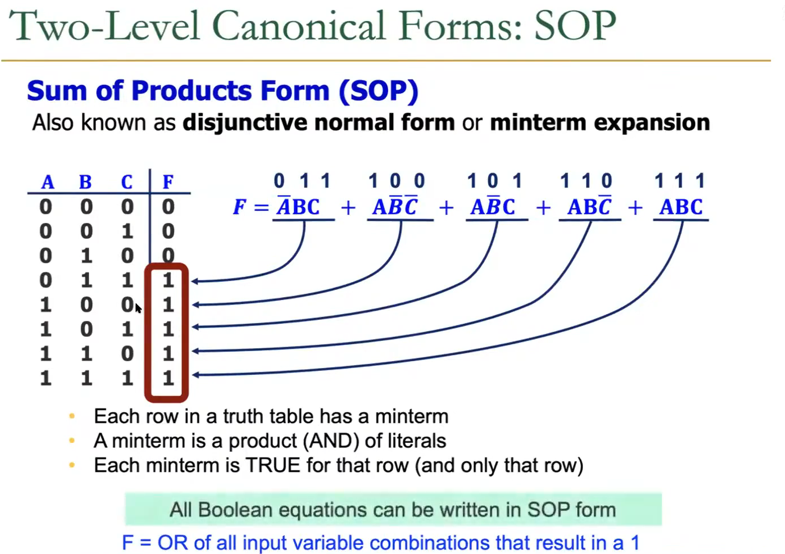
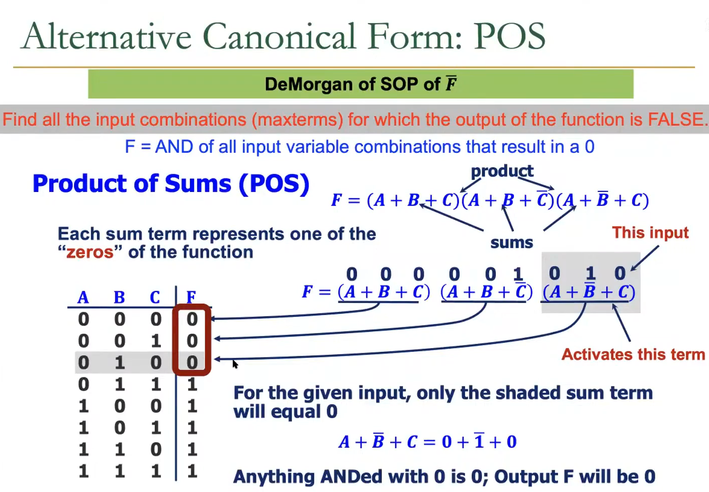
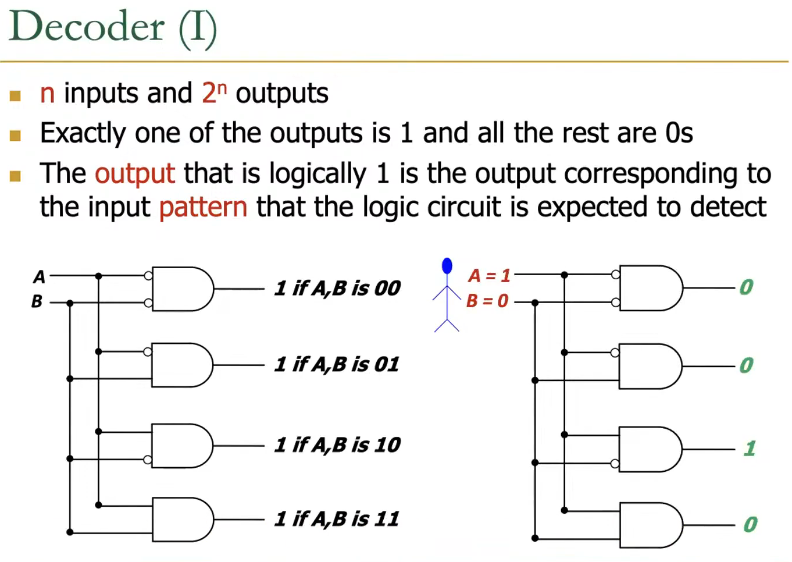
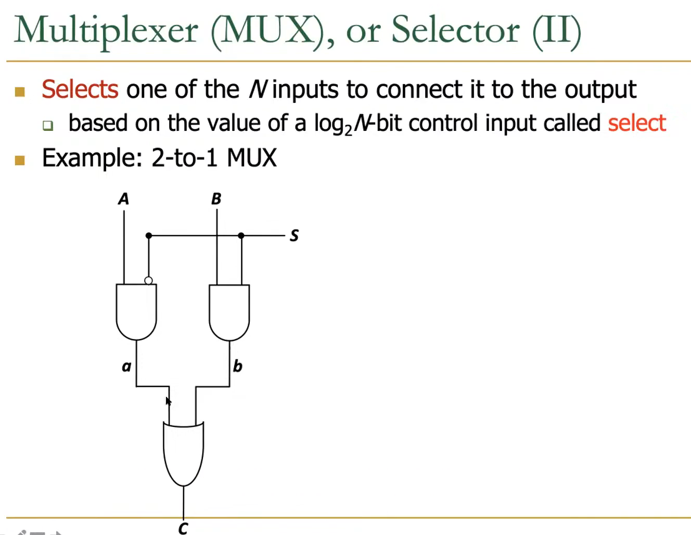
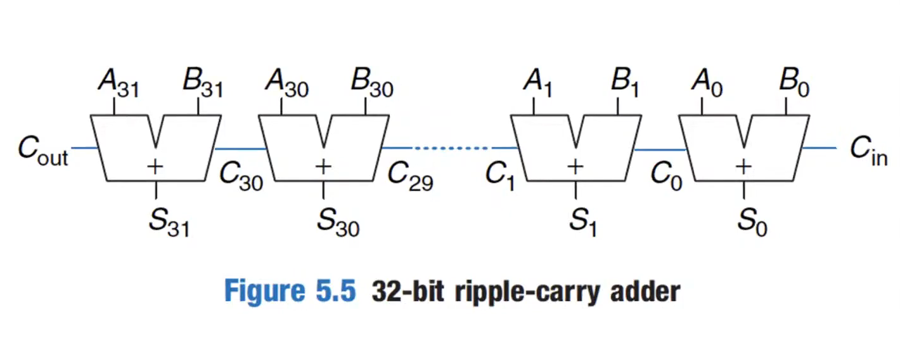

## Logic gates

>1. If both networks are ON at the same time, there is a short circuit(incorrect operation).
>2. If both networks are OFF at the same time, the output is floating.
### latency
> Series connections are slower than parallel connections.
> > More resistance on the wire.
### Power Consumption 
1. Dynamic Power Consumption
   1. power used to charge capacitance as signal change.   
   2. = C * V^2 *f
2. Static Power Consumption
   1. Power used when the signal do not change.
   2. v * I (leaked current)
3. Energy Consumption = power * time
---
>Combinational Logic vs. Sequential Logic

---
## Boolean Logic Equations
### Functional Specification
1. Unique **mapping** from input values to output values.
2. The **same** input values produce the same output values every time.
3. No **memory**(combinational design)

### SOP 1
>F = OR of all input variable combination that result in a 1;

>SOP form does **NOT** directly lead to the **minimal** logic.
### POS 0
>F = AND of all input variable combination that result in a 0;

---
## Decoder

---
## Selector

> | S | C |
> |---|---|
> | 0 | A |
> | 1 | B |
---
## Full Adder

---
## Programmable Logic Array
> a way of configuring the circuits such that they are in sum of SOP form.
