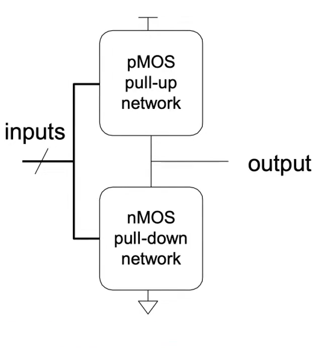

## Logic gates

>1. If both networks are ON at the same time, there is a short circuit(incorrect operation).
>2. If both networks are OFF at the same time, the output is floating.
### latency
> Series connections are slower than parallel connections.
> > More resistance on the wire.
### Power Consumption 
1. Dynamic Power Consumption
   1. power used to charge capacitance as signal change.   
   2. = C * V^2 *f
2. Static Power Consumption
   1. Power used when the signal do not change.
   2. v * I (leaked current)
3. Energy Consumption = power * time

