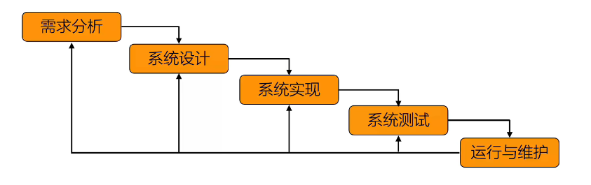
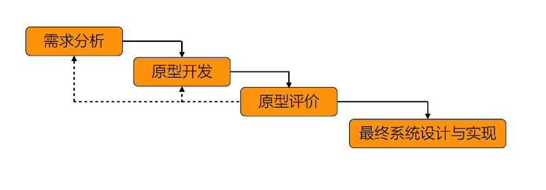
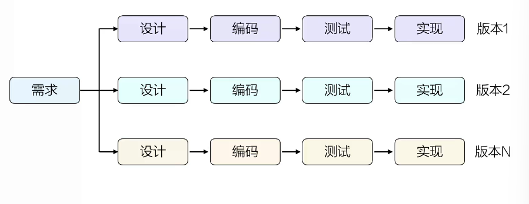
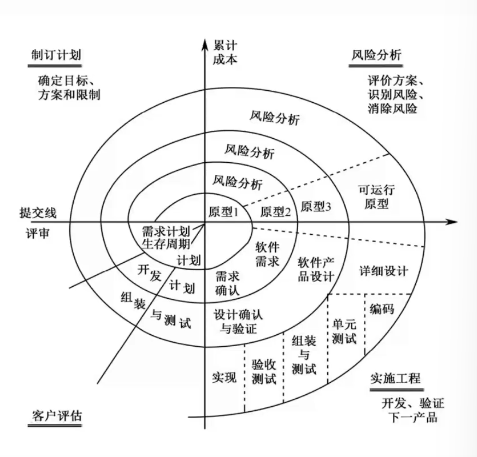
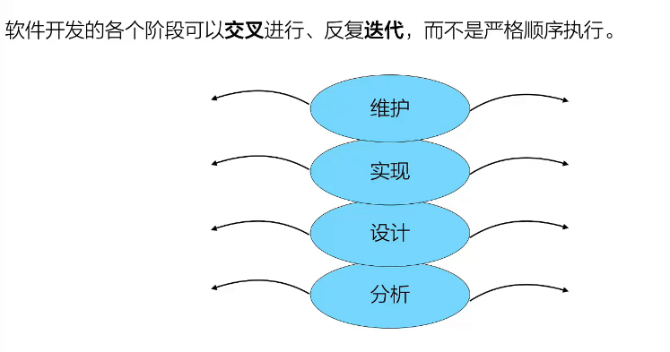
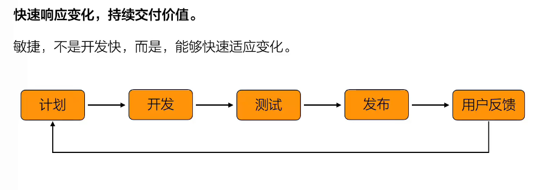
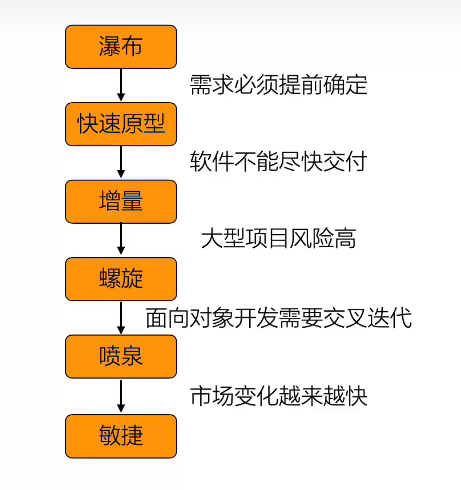

# 软件工程
## 三要素
1. 方法
   1. 结构化（功能）
   2. 面向对象
2. 工具
3. 过程
## 三个时期 八个阶段
1. 定义时期
    1. 问题定义
    2. 可行性分析
    3. 需求分析
2. 开发时期
    4. 总体设计
    5. 详细
    6. 编码和单元测试
    7. 综合测试
3. 运维时期
    8. 软件维护
---
# 模型
## 瀑布模型
>1. 严格按照固定阶段以此进行
>2. 需求十分明确

### 优点
1. 思路清晰（**需求明确**）
2. 文档规范
3. 管理方便
4. 需求稳定
### 缺点
1. 需求一开始完全确定
2. 客户参与少（仅仅参与需求确定）
3. 问题发现太晚
4. 无法适应需求变化（变化需推导从头再来）
---
## 快速原型模型 （解决需求不明确问题）
>1. 原型 ！= 最终产品
>2. 先写原型给用户体验

### 优点
1. 帮助用户明确需求
2. 用户满意度高
3. 修改成本低
4. 降低开发风险
### 缺点
1. 用户容易让用户误会
2. 开发人员偷懒
3. 不能解决开发效率问题（仅仅解决需求不明确问题）
### 原型工具
1. Axure
2. figma
3. 墨刀
---
## 增量模型
>每完成一个增量（功能），就交付使用
>每一个版本都经过软件开发周期

### 优点
1. 尽早投入使用
2. 反馈更及时
3. 开发风险降低
4. 项目容易管理
### 缺点
1. 系统必须能拆分（低耦合）
2. 总体设计要求高
3. 版本管理复杂
### 使用场景
1. 互联网产品：wechat
2. ERP
---
## 螺旋模型（风险）
> 每一轮开发都有加入风险分析

### 优点
1. 最大程度降低风险
2. 适合大型复杂项目
3. 用户参与度高
### 缺点
1. 成本高
2. 管理复杂
3. 过于依赖风险分析能力
### 使用场景
1. 高风险项目
---
以上模型 阶段划分非常明确
---
## 喷泉模型 （面向对象）
> 各个阶段交叉进行，反复迭代

### 优点
1. 符合面向对象
2. 修改方便
3. 支持软件复用
4. 符合真实开发（各个模型相辅相成）
### 缺点
1. 项目管理难
2. 开发过程不容易控制
3. 开发人员水平高
### 使用场景
1. Java项目
2. 长期维护的软件
---
## 敏捷开发（快速迭代）
> 快速适应变化

### 优点
1. 快速响应变化
2. 用户满意度高
3. 软件更新快
4. 风险低
### 缺点
1. 需求容易不断变化
2. 不适合大型固定项目
3. 依赖团队能力
4. 文档可能不足
### 使用场景
1. 互联网产品
2. 创业公司产品
---
>思想，需要融合。

---
## Summary
| 问题 |对于内容|
|------|------|
|做什么|生命周期|
|怎么做 |方法学（结构化、面向对象）|
|如何组织做 |过程模型|