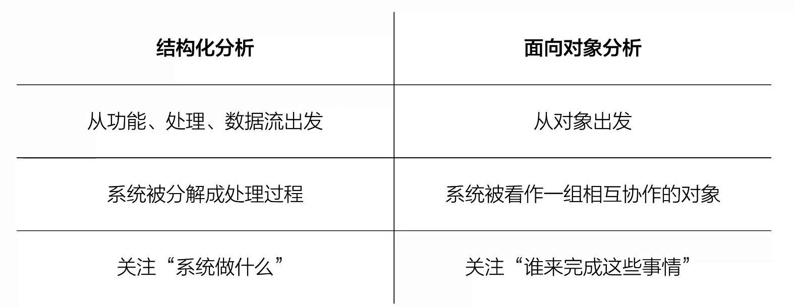
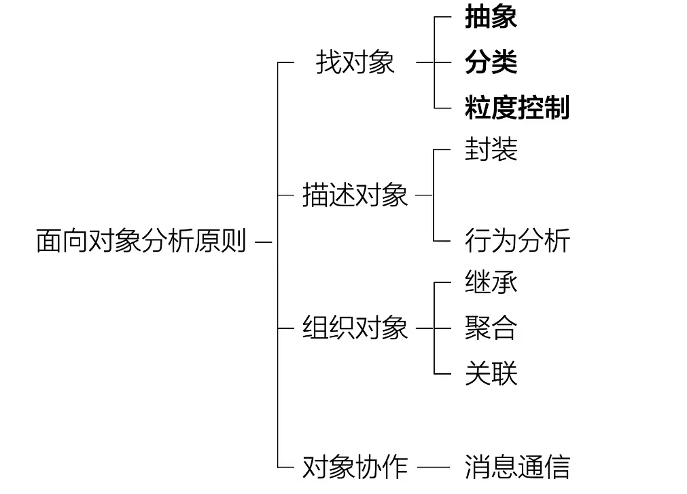

## OOA
### Structural VS. OOA

> 从需求中识别对象，并进一步分析对象的属性、职责、关系和协作
Output: 功能模型、对象模型、动态模型
### OOA Principle

1. **找对象**
   1. 抽象 
   > 抓重点 只需系统需要的信息
   2. 分类
   > 一组对象为一类
   3. 粒度控制
   > 不要陷入所有细节，也不要始终停留在过于粗略的层次（地图缩放）
2. **描述对象**
   1. 封装
   > 对内隐藏细节，对外暴露接口  （黑盒）  
   2. 行为分析
   > 确定每个对象应该承担什么职责
3. **组织对象**
   1. 继承
   > “ is-a " 
   2. 聚合
   > “ has-a "
   3. 关联
   > 对象之间存在某种业务联系
4. **对象协作**
   1. 消息通信
   > 通过发送请求其他对象完成其他操作
---
### OOD
> 考虑如何让程序员真正写得出来
> 把OOA产出的对象模型进一步转化为可以实现的软件设计
### OOP
**基本特点**
1. 封装
2. 继承
3. 多态
> 父类引用指向子类对象