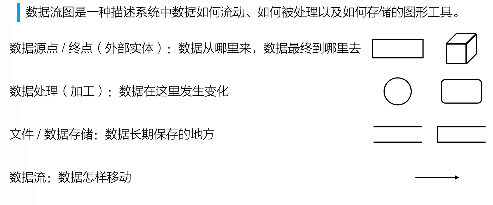
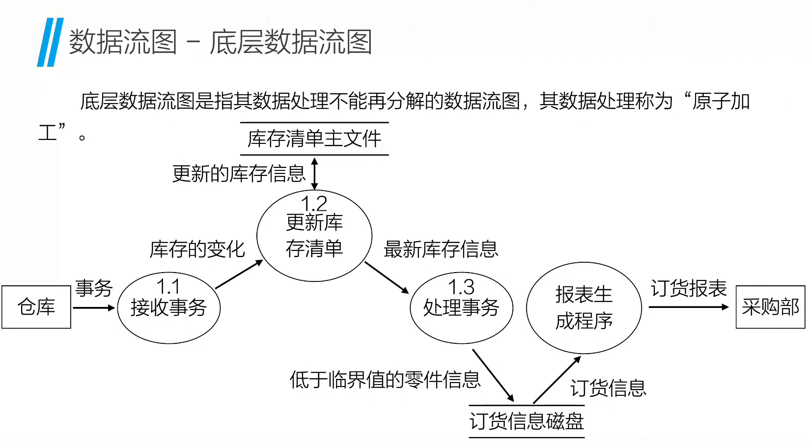
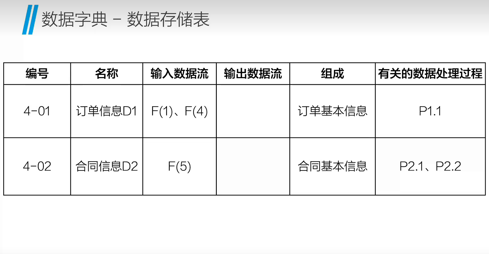
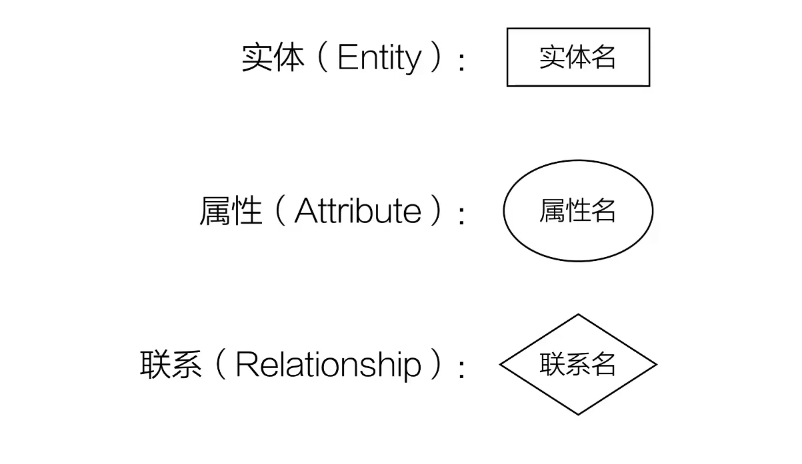

## Structural Analysis  
> 自顶向下 逐层拆解
> 将自然语言需求，转化为开发人员能够准确理解的模型
---
### Data Flow Diagram
>描述系统中数据如何流动，如何被处理以及如何存储

>分为顶层、中层、底层。
>除了顶层，其他DFD从0开始编号。

>原子性：事务中每一步操作要么全部成功，要么全部失败

#### 绘制原则
>1. 数据处理的输出数据流与输入数据流不应该同名，因为数据需要被加工处理
>2. 数据守恒
>3. 每个数据处理必须既有数据输入流也有数据输出流
>4. 数据流必须以一个外部实体开始，并且以一个外部实体结束
>5. 外部实体之间不应该存在数据流
---
### Data Dictionary
对数据模型中的数据元素、数据结构、数据存储、数据流、处理逻辑等进行**定义描述**

> DD + DFD = Logic Model

--- 
### Entity-Relation Diagram
1. Entity
2. Attribute
3. Relationship

>表示信息系统中的概念模型的数据存储
>服务于需求分析
